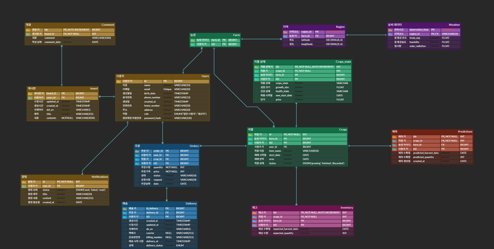

<h1 align="center" style="color: #50C878;"> OrderLabs 🌿</h1>

  

## 🧑🏻‍🌾 프로젝트 개요

  
  **"자라는 만큼만 주문받는다."**  

이 서비스는 농·수산물의 생육 상태나 생물의 건강 데이터를 기반으로 주문 가능 여부를 
자동 판단하고 관리하는 스마트 주문 관리 플랫폼입니다. 
기존의 단순 재고 기반 판매 방식과 달리, 생물의 생육데이터 여기서는 공공 데이터(예: 
기상정보, 생육 센서 데이터 등)와 실시간 수집된 생물 정보(예: 수산물 성장률, 건강도)를 
분석하여 언제 주문을 받을 수 있고, 언제 배송이 가능한지를 예측 및 자동 통제합니다. 
이를 통해 생산자는 재고 과잉이나 무리한 주문을 방지하고, 소비자는 더 신선하고 정확한 
일정으로 상품을 수령할 수 있습니다. 
생물은 자라야 팔 수 있습니다. 우리는 그 ‘자라는 과정’까지 주문 시스템에 담습니다.

  

## 🕵️ 팀원 소개

|      |      |   |    |          |
| :--------------------------------------------------------: | :--------------------------------------------------------: | :--------------------------------------------------------: | :------------------------------------------------------: | :----------------------------------------------------------: |
| 🐰 **양승우** [@atimaby28](https://github.com/miyad927) | 🧶 **이시욱** [@David9733](https://github.com/David9733) | ⚽ **구창모** [@kucha240](https://github.com/kucha240) | 🐢 **유현경** [@gaangstar](https://github.com/gaangstar) | 🐉 **윤소민** [@somminn](https://github.com/somminn) |

 

## 📝 요구 사항 명세서

  

## ☁️ ERD

  
  [⬆️ERD CLOUD 바로가기](https://www.erdcloud.com/d/GjgSeJRtpNC9jNFpG)

  

## ⚙️ 시스템 아키텍처

  

    저희는 데이터 서버를 6대를 구성하였고  
    두 서버는 Replication, 세 서버는 Clustering 나머지 한 서버는 연산을 위한 전용 서버로 구성하였습니다.

  

  
Why replication?

   
    운영 서버는 단일 DB 장애 시 전체 서비스가 중단되는 것을 막기 위해 Data Replication을 사용했습니다. 예를 들어, Master-Slave 구조로 구성해서 Master 장애 시 Slave로 자동 전환(Failover)이 가능하도록 했습니다. 이를 통해 서비스의 가용성과 안정성을 최우선으로 하였습니다.
   

  
Why database clustering?

   
    작물 상태나 온도, 습도, 일사량 등의 실시간 기상 데이터가 끊기면 자동화 시스템이 오작동할 수 있어, 클러스터로 장애 대비를 했습니다.

  
Why Calculate database?

   
    운영 DB에 부하를 주지 않고 분석 작업과 계산 작업을 수행하기 위해 별도의 데이터베이스를 사용했습니다. 시계열 데이터를 다룬다는 점과 집계 쿼리를 반복 수행하기 위해, 운영 서비스 성능에 영향을 주지 않도록 했습니다.

  
